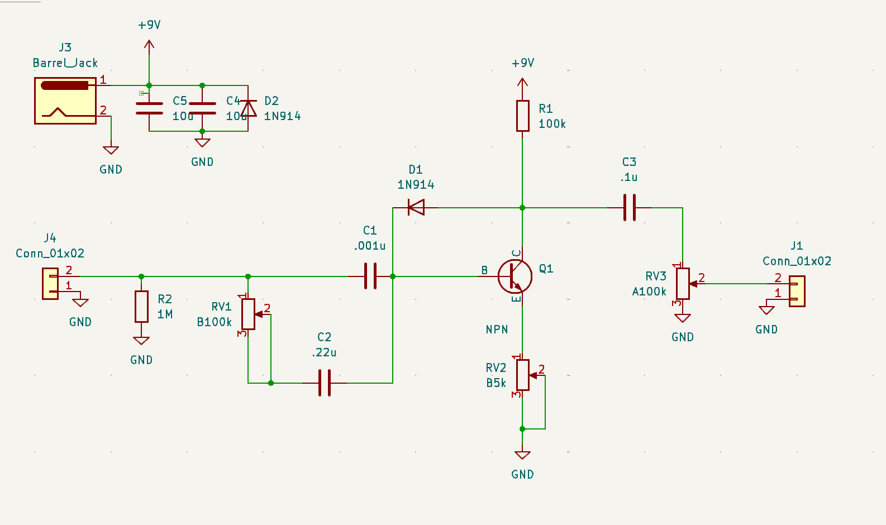

# Yeabsira Hawaz's Portfolio


## Intro

 Hello my name's Yeabsira Hawaz and I'm currently a rising Senior at MIT studying Electrical Engineering and Computer Science. I interested in working across the hardware-software stack, digital systems, chip design, and all things low level.

 Here's my [resume](photos/resume.pdf), and feel free to reach me at [yhawaz AT mit DOT edu]. 
 

I'm currently hardware engineering interning at ZeroRisc working on transparent trustworthy silicon.

My research is centered around developing network on chip for hardware accelerator targeting sparse linear algebra under Prof. Daniel Sanchez. Outside of making hardware run fast or , I really enjoy playing music I play bass for MIT's Jazz Combos, DJ, and making synths :p.

#### [My Projects](#projects)
#### [My Courswork](#relevant-coursework)

## Projects


I feel like most people would rank these based off date, but I'm ranking them based off how much I like them.
### HoloForge: a camera-controlled 3D model viewer on a FPGA
*Final Project for 6.205(6.111): Digital Systems Laboratory*


 <br>
In this class, assignments were completed in SystemVerilog and deployed to Xilinx FPGAs.
<!-- sample assingments if you wanna do that -->
The class concluded with an open-ended final project, and my partner and I decided to create a camera-controlled 3D Model viewer that could render 3D-meshes, and change the view of the scene based on real-time camera inputs. We also decided to utilize the offboard DDR3 RAM for our framebuffer to allow for better resolution down the line.

We currently have successful rendering of 3D objects like the cube shown above, and the ability to change the view of the cube based off camera inputs. The graphics pipeline starts with the pre-proc stage that takes in points from a triangle and virtual camera positions from the camera module, converts them to NDC coordinates, and performs boundary checks before passing them to the rasterizer. Simultaneously, the shader takes in the color of the given triangle and the current light source, finds the color intensity, and passes that new color into the rasterizer. The rasterizer then performs a Barycentric interpolation and checks if we've processed any points outside of the triangle and eliminates them. From there, we pass this depth, x, y, and color to our working framebuffer that interacts with the offboard DDR3 RAM via a wrapper I wrote that talks to a MIG over the AMBA AXI protocol.

The reason we decided to use a MIG with AMBA AXI was that it made it easier to write out-of-order addresses to the MIG via a custom stacker we wrote. This stacker takes the 16-bit color values that come out of the graphics pipeline and stacks them into 128 bits (with varying strobes based on whether the data is in order) that get fed into the MIG. We have two frames in the DRAM for clearing and switching, and we have working view changes without the camera(which I will hopefully get working soon). For more information, just read the report. However, note we implemented a portion of features after the class was over.

<!-- results here -->
 - dates: November 2024
 - collaborators: Mena Filfil
 - contribution: pixel-preproccessing, framebuffer, DDR3 memory interfacing, camera control and interface
 - code: [github.com/Menamonmon/holoforge](https://github.com/Menamonmon/holoforge)
 - report: [pdf](photos/holo_report.pdf)


<!-- ### Jazzy Dude -->
<!---->
<!-- -I feel sloppy -->

### snorOS
*Hobby Proj*

I wrote a kernel for a 32-bit x86 monolothic single-tasking operating system in C.I used GRUB 2 as the bootloader, and used bootstrap assembly when I needed to. The main motivation behind doing this was to flex my C skills, but also to learn how operating systems and the interconnect between machine code and software works. 

So far it has working interrupts, VGA drivers, and keyboard drivers all written by me. It also has a working driver for interacting with the ports on the PIC controller. Currently working on implementing the shell. It currently could in theory run on a Intel i386, but I can't really get my hands on one of those. 

So far it's been a really educational project, since any tutorial on writing an OS aren't great so the main way to learn is by reading the Intel docs, and learning a lot of theory yourself. I hope to write an actually interactable UI soon. Currently my hopes are for it to have a very bare bones, UI and eventually branch into custome file mangemant and memory allocation. I also want to run doom on it. Feel to grab the iso file from my github and run it in your emulator of choice(I personally prefer qemu, if you also use qemu just run  `qemu-system-i386 -cdrom snorOs.iso`).

 - dates: June 2024-Present
 - code: [github.com/yhawaz/snorOs](https://github.com/yhawaz/snorOs)

### Bass Guitar Pedals
*Hobby Proj*

 
 <br>
 I breadboarded a fuzz pedal circuit and then designed a PCB for it in KiCad. I’m using two capacitors in parallel, with one connected to a potentiometer to adjust the aggressiveness of the fuzz. The fuzz is created by running the audio signal into a BJT, where the bass signal goes to the transistor’s base (get it?), and a diode between the bass signal and the collector provides clipping. The main motivation behind this project was to get some hands-on experience with circuits before taking the class, as well as to learn KiCad. Also, bass guitar pedals are really expensive, while transistors and resistors are quite cheap. Hopefully, I’ll get the PCB printed over winter break, and I hope this project eventually grows into a full collection of “bass pedals.”


### CacheMeOutside: A SuperScalar Proccessor
*Final Project for 6.1920(6.175) Constructive Computer Archtectiure* 

 <br>
 <br>

In this class assignments were completed in BlueSpec (a SystemVerilog spinoff). For our final project, we were tasked with picking from one of the various optimizations we covered in class and applying it to a pipelined-processor we had previously written as an assignment. My group decided to implement a SuperScalar Processor with a branch-target buffer and synth it on a Xilinx FPGA. We ended up being the only functioning SuperScalar processor that semester. A diagram explaining our processor and our konata logs demonstrating it actually performs two instructions per cycle are shown above.

 - dates: April 2024-May 2024
 - collaborators: Armando Moncada and Orion li
 - contribution: designing and implementing a majority of the SuperScalar logic
 - code: [github.com/yhawaz/superscalar_proccessor](https://github.com/yhawaz/superscalar_proccessor)
 - report: [pdf](photos/cachereport.pdf)


### Autonomous Robo Car
*Project for 16.632 Intro to Autonomous Machines* <br>
<br>
In this class, we worked on assignments involving an Arduino-based car that used IR sensors, photoresistors, and force sensors. To achieve accurate line-following, I implemented discrete-time digital PID control systems and refined the underlying math to ensure precise performance.

 - dates: December 2023
 - code: [github.com/yhawaz/RoboCar](https://github.com/yhawaz/RoboCar)

<!-- ## My Past Experiences -->

## Relevant Coursework
### Spring 2025
Microcomputer Laboratory <br>
Semiconductors <br>
### Fall 2024
Digital Systems Laboratory <br> 
Linear Algebra <br> 
Circuits  
### Spring 2024 
Constructive Computer Architecture <br> 
Algorithms and Data Structures   
### Fall 2023
Computer Architecture <br>
Discrete Mathematics <br> 
Intro to Music Tech <br> 
Geospatial Software 
### Spring 2023
Fundamentals of Programming (taught in python) <br>  
Physics: Electricity and Magnetism

### Fall 2022
Intro to Programming via C and Assembly <br> 
Intro to Programming via Python <br> 
Physics: Classical Mechanics <br> 
Multivariable Calculus 

<!-- #### h4 Heading
##### h5 Heading
###### h6 Heading -->


<!-- ## Horizontal Rules

___

---

***


## Typographic replacements

Enable typographer option to see result.

(c) (C) (r) (R) (tm) (TM) (p) (P) +-

test.. test... test..... test?..... test!....

!!!!!! ???? ,,  -- ---

"Smartypants, double quotes" and 'single quotes'


## Emphasis

**This is bold text**

__This is bold text__

*This is italic text*

_This is italic text_

~~Strikethrough~~


## Blockquotes


> Blockquotes can also be nested...
>> ...by using additional greater-than signs right next to each other...
> > > ...or with spaces between arrows.


## Lists

Unordered

+ Create a list by starting a line with `+`, `-`, or `*`
+ Sub-lists are made by indenting 2 spaces:
  - Marker character change forces new list start:
    * Ac tristique libero volutpat at
    + Facilisis in pretium nisl aliquet
    - Nulla volutpat aliquam velit
+ Very easy!

Ordered

1. Lorem ipsum dolor sit amet
2. Consectetur adipiscing elit
3. Integer molestie lorem at massa


1. You can use sequential numbers...
1. ...or keep all the numbers as `1.`

Start numbering with offset:

57. foo
1. bar


## Code

Inline `code`

Indented code

    // Some comments
    line 1 of code
    line 2 of code
    line 3 of code


Block code "fences"

```
Sample text here...
```

Syntax highlighting

``` js
var foo = function (bar) {
  return bar++;
};

console.log(foo(5));
```

## Tables

| Option | Description |
| ------ | ----------- |
| data   | path to data files to supply the data that will be passed into templates. |
| engine | engine to be used for processing templates. Handlebars is the default. |
| ext    | extension to be used for dest files. |

Right aligned columns

| Option | Description |
| ------:| -----------:|
| data   | path to data files to supply the data that will be passed into templates. |
| engine | engine to be used for processing templates. Handlebars is the default. |
| ext    | extension to be used for dest files. |


## Links

[link text](http://dev.nodeca.com)

[link with title](http://nodeca.github.io/pica/demo/ "title text!")

Autoconverted link https://github.com/nodeca/pica (enable linkify to see)


## Images


Like links, Images also have a footnote style syntax

![Alt text][id]

With a reference later in the document defining the URL location:

[id]: https://octodex.github.com/images/dojocat.jpg  "The Dojocat"


## Plugins

The killer feature of `markdown-it` is very effective support of
[syntax plugins](https://www.npmjs.org/browse/keyword/markdown-it-plugin).


### [Emojies](https://github.com/markdown-it/markdown-it-emoji)

> Classic markup: :wink: :cry: :laughing: :yum:
>
> Shortcuts (emoticons): :-) :-( 8-) ;)

see [how to change output](https://github.com/markdown-it/markdown-it-emoji#change-output) with twemoji.


### [Subscript](https://github.com/markdown-it/markdown-it-sub) / [Superscript](https://github.com/markdown-it/markdown-it-sup)

- 19^th^
- H~2~O


### [\<ins>](https://github.com/markdown-it/markdown-it-ins)

++Inserted text++


### [\<mark>](https://github.com/markdown-it/markdown-it-mark)

==Marked text==


### [Footnotes](https://github.com/markdown-it/markdown-it-footnote)

Footnote 1 link[^first].

Footnote 2 link[^second].

Inline footnote^[Text of inline footnote] definition.

Duplicated footnote reference[^second].

[^first]: Footnote **can have markup**

    and multiple paragraphs.

[^second]: Footnote text.


### [Definition lists](https://github.com/markdown-it/markdown-it-deflist)

Term 1

:   Definition 1
with lazy continuation.

Term 2 with *inline markup*

:   Definition 2

        { some code, part of Definition 2 }

    Third paragraph of definition 2.

_Compact style:_

Term 1
  ~ Definition 1

Term 2
  ~ Definition 2a
  ~ Definition 2b


### [Abbreviations](https://github.com/markdown-it/markdown-it-abbr)

This is HTML abbreviation example.

It converts "HTML", but keep intact partial entries like "xxxHTMLyyy" and so on.

*[HTML]: Hyper Text Markup Language -->

<!-- ### [Custom containers](https://github.com/markdown-it/markdown-it-container)

::: warning
*here be dragons*
::: -->
