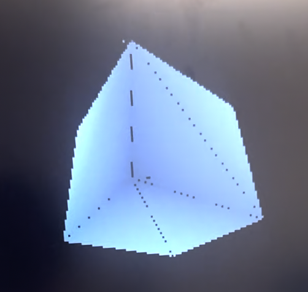
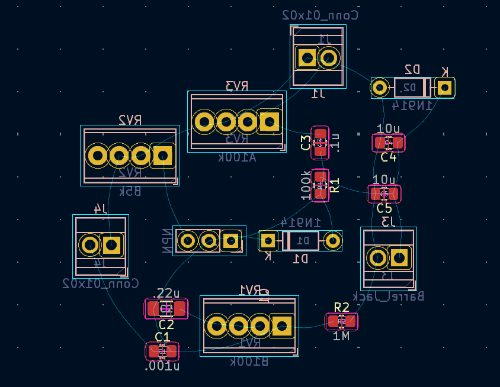
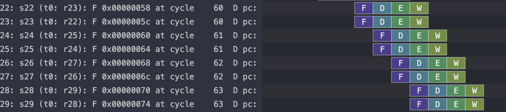
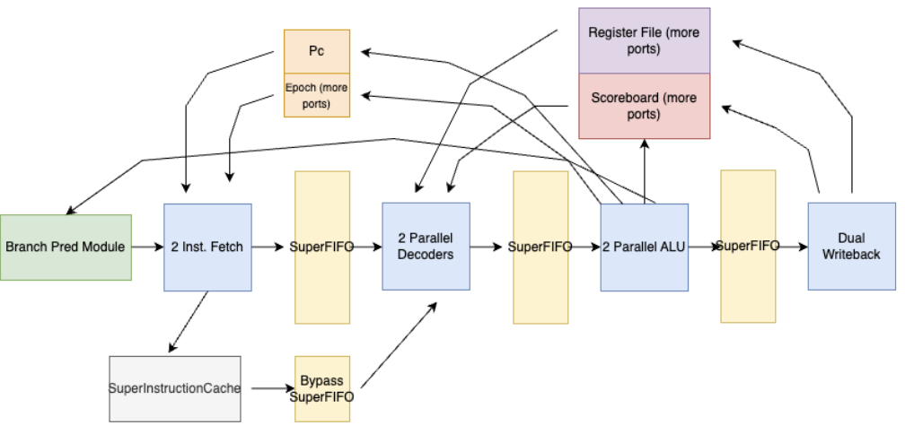
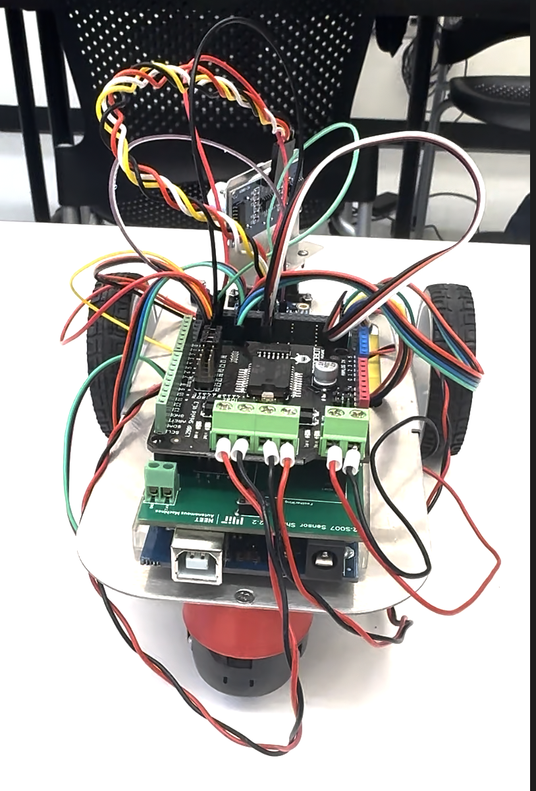

# Yeabsira Hawaz's Portfolio


## Intro

 Hello my name's Yeabsira Hawaz and I'm currently a third year undergrad at MIT studying Electrical Engineering and Computer Science. I'm interested in working across the hardware-software stack, digital system design, and all things low level.

 Here's my [resume](photos/resume.pdf), and feel free to reach me at [yhawaz AT mit DOT edu]. 

 I'm currently working on developing network on chip for hardware accelerators targetting sparse linear algebra under Prof. Daniel Sanchez. Outside of making hardware run fast or making really ugly breadboards in lab, I really enjoy playing music I play bass for MIT's Jazz Combos, DJ, and love making weird sounds in abelton. 

#### [Cool Projects](#projects)
<!-- #### [Past Experiences](#my-past-experiences) -->
#### [My Courswork](#relevant-coursework)

## Projects
### HoloForge: a camera-controlled 3D model viewer on FPGA
*Final Project for 6.205(6.111): Digital Systems Laboratory*


In this class, assignments were completed in SystemVerilog and deployed to Xilinx FPGAs.
<!-- sample assingments if you wanna do that -->
The class concluded with a open-ended final project, and my parter and I decided to create a camera-controlled 3D Model viewer that could render 3D-meshes, and change the view of the scene based on real-time camera inputs. We also decided to utilize the offboard DDR3 ram for our framebuffer to allow for better resoultion down the line.
 - dates: November 2024
 - collaborators: Mena Filfil
 - contribution: pixel-preproccessing, framebuffer, DDR3 memory interfacing, camera control and interface
 - code: [github.com/Menamonmon/holoforge](https://github.com/Menamonmon/holoforge)
 - report: [pdf](photos/holo_report.pdf)

### SnorOS
*Hobby Proj*

I wrote a kernel for a 32-bit x86 monolothic single-tasking operating system in C. It has working interrupts, VGA drivers, and keyboard drivers all written by me. I used GRUB 2 as the bootloader, and used bootstrap assembly when I needed to. The main motivation behind doing this was to flex my C skills, but also to learn how operating systems and the interconnect between machine code and software works. So far it's been a really educational project, since any tutorial on writing a OS aren't great so the main way to learn is by reading the Intel docs, and learning a lot of theory yourself. I hope to write a actually interactable with UI soon.

 - dates: June 2024-Present
 - code: [github.com/yhawaz/snorOs](https://github.com/yhawaz/snorOs)

## Bass Guitar Pedals
**Hobby Proj*


I breadboarded circuits for a fuzz pedal, then designed a pcb for it in kicad. The main motivation behind this project was to get some exposure to circuits before I took the class, and learn kicad. Also, bass guitar pedals are really expensive, and transistors and resistors are really cheap. 

### CacheMeOutside: A SuperScalar Proccessor
*Final Project for 6.1920(6.175) Constructive Computer Archtectiure* 

 <br>
 <br>
In this class assignments were completed in BlueSpec a System-Verilog spinoff, for our final-project we were tasked with picking from one of the various optimizations we covered in class and applying it to a pipelined-proccessor we had previously written as an assignment. My group decided to implement a SuperScalar Proccessor with a branch-target buffer, and apply it to a physical FPGA. We ended up being the only functioning SuperScalar proccessor that semester. A diagram explaining our proccessor and our konata logs demonstrating it actually performs two instruction per cycle are photographed above.

 - dates: April 2024-May 2024
 - collaborators: Armando Moncada and Orion li
 - contribution: designing and implementing a majority of the SuperScalar logic
 - code: [github.com/yhawaz/superscalar_proccessor](https://github.com/yhawaz/superscalar_proccessor)
 - report: [pdf](photos/cachereport.pdf)


### Autonomous Robo Car
*Project for 16.632 Intro to Autonomous Machines*
<br>
In this class, we worked on assignments involving an Arduino-based car that used IR sensors, photoresistors, and force sensors. To achieve accurate line-following, I implemented discrete-time digital PID control systems and refined the underlying math to ensure precise performance.

 - dates: Dececember 2023
 - code: [github.com/yhawaz/RoboCar](https://github.com/yhawaz/RoboCar)

<!-- ## My Past Experiences -->

## Relevant Coursework
### Fall 2024
Digital Systems Labroatory <br> 
Linear Algebra <br> 
Circuits  
### Spring 2024 
Constructive Computer Archtectiure <br> 
Algorithims and Data Structures   
### Fall 2023
Computer Archtectiure <br> 
Discrete Mathematics <br> 
Intro to Music Tech <br> 
Geospatial Software 
### Spring 2023
Fundamentals of Programming (taught in python) <br>  
Physics: Electricity and Mangnetism 
### Fall 2022
Intro to Programming via C and Assembly <br> 
Intro to Programming via Python <br> 
Physics: Classical Mechanics <br> 
Multivariable Calculus 


<!-- #### h4 Heading
##### h5 Heading
###### h6 Heading -->


<!-- ## Horizontal Rules

___

---

***


## Typographic replacements

Enable typographer option to see result.

(c) (C) (r) (R) (tm) (TM) (p) (P) +-

test.. test... test..... test?..... test!....

!!!!!! ???? ,,  -- ---

"Smartypants, double quotes" and 'single quotes'


## Emphasis

**This is bold text**

__This is bold text__

*This is italic text*

_This is italic text_

~~Strikethrough~~


## Blockquotes


> Blockquotes can also be nested...
>> ...by using additional greater-than signs right next to each other...
> > > ...or with spaces between arrows.


## Lists

Unordered

+ Create a list by starting a line with `+`, `-`, or `*`
+ Sub-lists are made by indenting 2 spaces:
  - Marker character change forces new list start:
    * Ac tristique libero volutpat at
    + Facilisis in pretium nisl aliquet
    - Nulla volutpat aliquam velit
+ Very easy!

Ordered

1. Lorem ipsum dolor sit amet
2. Consectetur adipiscing elit
3. Integer molestie lorem at massa


1. You can use sequential numbers...
1. ...or keep all the numbers as `1.`

Start numbering with offset:

57. foo
1. bar


## Code

Inline `code`

Indented code

    // Some comments
    line 1 of code
    line 2 of code
    line 3 of code


Block code "fences"

```
Sample text here...
```

Syntax highlighting

``` js
var foo = function (bar) {
  return bar++;
};

console.log(foo(5));
```

## Tables

| Option | Description |
| ------ | ----------- |
| data   | path to data files to supply the data that will be passed into templates. |
| engine | engine to be used for processing templates. Handlebars is the default. |
| ext    | extension to be used for dest files. |

Right aligned columns

| Option | Description |
| ------:| -----------:|
| data   | path to data files to supply the data that will be passed into templates. |
| engine | engine to be used for processing templates. Handlebars is the default. |
| ext    | extension to be used for dest files. |


## Links

[link text](http://dev.nodeca.com)

[link with title](http://nodeca.github.io/pica/demo/ "title text!")

Autoconverted link https://github.com/nodeca/pica (enable linkify to see)


## Images


Like links, Images also have a footnote style syntax

![Alt text][id]

With a reference later in the document defining the URL location:

[id]: https://octodex.github.com/images/dojocat.jpg  "The Dojocat"


## Plugins

The killer feature of `markdown-it` is very effective support of
[syntax plugins](https://www.npmjs.org/browse/keyword/markdown-it-plugin).


### [Emojies](https://github.com/markdown-it/markdown-it-emoji)

> Classic markup: :wink: :cry: :laughing: :yum:
>
> Shortcuts (emoticons): :-) :-( 8-) ;)

see [how to change output](https://github.com/markdown-it/markdown-it-emoji#change-output) with twemoji.


### [Subscript](https://github.com/markdown-it/markdown-it-sub) / [Superscript](https://github.com/markdown-it/markdown-it-sup)

- 19^th^
- H~2~O


### [\<ins>](https://github.com/markdown-it/markdown-it-ins)

++Inserted text++


### [\<mark>](https://github.com/markdown-it/markdown-it-mark)

==Marked text==


### [Footnotes](https://github.com/markdown-it/markdown-it-footnote)

Footnote 1 link[^first].

Footnote 2 link[^second].

Inline footnote^[Text of inline footnote] definition.

Duplicated footnote reference[^second].

[^first]: Footnote **can have markup**

    and multiple paragraphs.

[^second]: Footnote text.


### [Definition lists](https://github.com/markdown-it/markdown-it-deflist)

Term 1

:   Definition 1
with lazy continuation.

Term 2 with *inline markup*

:   Definition 2

        { some code, part of Definition 2 }

    Third paragraph of definition 2.

_Compact style:_

Term 1
  ~ Definition 1

Term 2
  ~ Definition 2a
  ~ Definition 2b


### [Abbreviations](https://github.com/markdown-it/markdown-it-abbr)

This is HTML abbreviation example.

It converts "HTML", but keep intact partial entries like "xxxHTMLyyy" and so on.

*[HTML]: Hyper Text Markup Language -->

<!-- ### [Custom containers](https://github.com/markdown-it/markdown-it-container)

::: warning
*here be dragons*
::: -->
